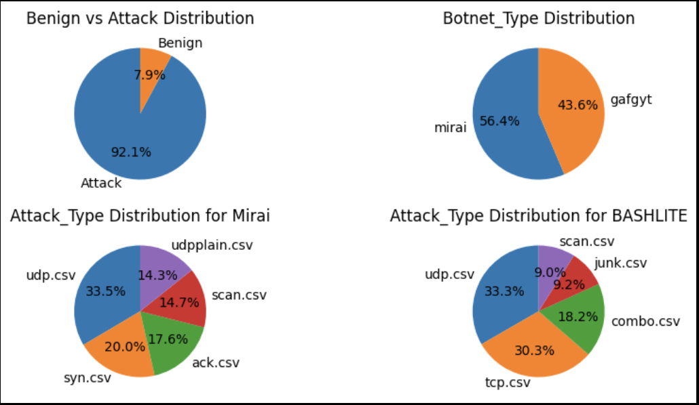
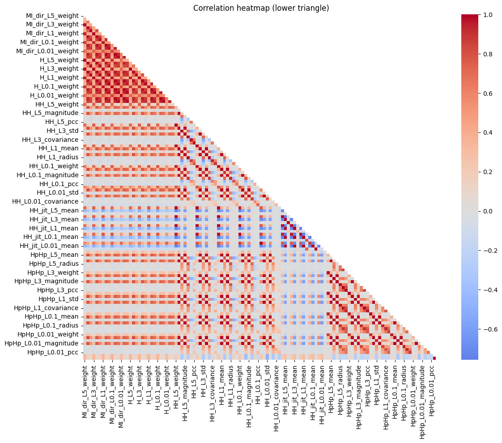

# CSE151A-Project

## Dataset Link 
UCI Machine Learning Repository – Detection of IoT Botnet Attacks (N-BaIoT):  
https://archive.ics.uci.edu/dataset/442/detection+of+iot+botnet+attacks+n+baiot

## Environment Setup Requirements
Tested with Python 3.11.

Required packages:
```
pip install pandas numpy seaborn matplotlib scikit-learn patool
```
Also install an external archiver (7-Zip or WinRAR) so `patoolib` can call it.

## Data Exploration
### Observations
Benign traffic loaded from all 9 devices: **555,932 rows**   
Attack traffic rows: **6506674** .  
Total working dataset used so far: **7062606**.

### Columns / Features
Total columns in working benign dataset (after adding labels): 119
- 115 numeric network telemetry feature columns (engineered statistical features over temporal decay windows)
- 3 categorical device column: `Device`, `Attack_Type` and `Botnet_Type`
- 1 binary target column: `is_attack`

So merged frame columns count = 119 (when `is_attack` added).

#### Network Columns Structure 
Prefixes/Feature Types:
- `MI_...` Mutual-information–style directional weights / stats
- `H_...` Host-based aggregate statistics
- `HH_...` Host-host (pairwise) stats
- `HH_jit_...` Jitter-related temporal variability stats
- `HpHp_...` Higher-order / socket or port pair statistics
(5 total)

Each Feature Type/Prefix also has 5 window levels. 
Scale tokens (decay / window levels): `L5`, `L3`, `L1`, `L0.1`, `L0.01` (long → short windows).

For each of these prefix-window level combinations we have statistics that can include SOME of the following.
Stat suffixes: weight, mean, variance, std, magnitude, radius, covariance, pcc (8 total).

5 * 5 * 8 = 200 (However not all are included)

Exceptions are listed here (Generated using an LLM)
MI_dir_: missing std, magnitude, radius, covariance, pcc 
H_: missing std, magnitude, radius, covariance, pcc 
HH_jit_: missing std, magnitude, radius, covariance, pcc 
HH_: missing variance 
HpHp_: missing variance

5*5 + 5*5 + 5*5 + 5 + 5 = 85 <br>
200 - 85 = 115


#### Data Scales & Types
- All 115 feature columns: Continuous numeric (ratio / sometimes approximately positive real-valued). Distributions are typically **right‑skewed** (heavy tails) for weights and magnitudes; means cluster around device‑specific baselines; variances / std features show sparse larger spikes.
- `Device`: Nominal categorical (9 distinct values):
	- Danmini_Doorbell
	- Ecobee_Thermostat
	- Ennio_Doorbell
	- Philips_B120N10_Baby_Monitor
	- Provision_PT_737E_Security_Camera
	- Provision_PT_838_Security_Camera
	- Samsung_SNH_1011_N_Webcam
	- SimpleHome_XCS7_1002_WHT_Security_Camera
	- SimpleHome_XCS7_1003_WHT_Security_Camera
- is_attack: Binary (0 = benign, 1 = attack).
- Attack_Type: Nominal categorical (3 distinct values)
    - udp.csv
    - udpplain.csv
    - scan.csv
    - ack.csv
    - syn.csv
    - junk.csv
    - combo.csv
    - tcp.csv
- Botnet_Type: Nominal categorical (3 distinct values)
    - Gafgyt
    - Mirai

### Target Column
is_attack (binary):
- 0 → benign traffic
- 1 → attack traffic 
  
### Missing Values
Computed in notebook: **0 missing values** across all loaded columns.

### Duplicate Rows
Computed in notebook: **157779** across entire df. 

## Pre-processing data plan

- Remove highly correlated features to avoid redundancy and multicollinearity
- Handle outliers so that extreme values do not dominate training
- Drop duplicates and unneeded columns to keep the dataset clean and efficient
- Balance the data by equally sampling between:
  - attack vs benign traffic
  - different botnet families
  - different attack types
- Normalize and standardize features so that all variables contribute equally to the model
- Remove data with minimal weight (very small subsets or irrelevant samples) to reduce noise

## Data Plots



Benign vs Attack Distribution<br>
This plot shows a clear imbalance in the dataset, where attack traffic dominates with about 92.1% of the total data compared to only 7.9% benign traffic. Such imbalance indicates that any model trained on this dataset must account for the disproportionate number of attack samples, otherwise it may simply learn to predict “attack” most of the time.

Botnet_Type Distribution <br>
The dataset consists of two main botnet families, Mirai and Gafgyt (BASHLITE). The plot reveals that Mirai accounts for 56.4% of the attack data, while Gafgyt contributes 43.6%. This relatively even split ensures that both families are well represented, allowing for fairer analysis of how models detect different attack origins.

Attack_Type Distribution for Mirai <br>
Breaking down Mirai further, the plot highlights that UDP-based floods are the most dominant attack type (33.5%), followed by SYN floods (20.0%), ACK floods (17.6%), and smaller proportions of scanning (14.7%) and udpplain attacks (14.3%). This shows that Mirai primarily relies on high-volume flooding techniques, with UDP traffic playing the most significant role.

Attack_Type Distribution for BASHLITE <br>
In contrast, the BASHLITE (Gafgyt) botnet has a more diverse distribution of attack types. The plot indicates that UDP floods (33.3%) and TCP floods (30.3%) are the largest contributors, while combo (18.2%), junk (9.2%), and scanning (9.0%) attacks make up the remainder. Unlike Mirai, BASHLITE employs both UDP and TCP traffic heavily, demonstrating a broader attack strategy.



Heatmap <br>
The correlation heatmap visualizes the relationships between all numerical features in the dataset. Many features show strong positive correlations, forming clusters that suggest redundancy. This means that some features may not add unique information and could potentially be removed or reduced through dimensionality reduction techniques like PCA. Addressing this correlation structure is important to improve computational efficiency and reduce overfitting during model training.